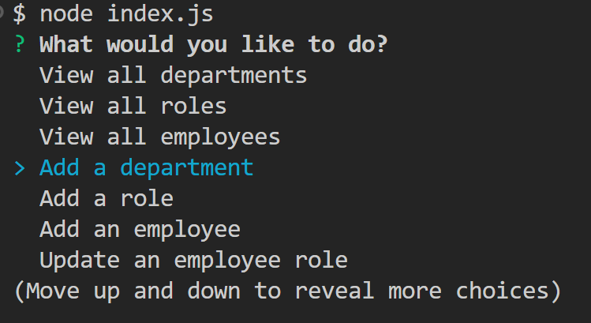

# Employee Tracker  
## Description  
Employee Tracker is a command-line application built using Node.js, Inquirer 8.2.4, and PostgreSQL. It allows users to manage their company's employee database, including departments, roles, and employees. This application provides functionalities to view, add, update and delete records in the database.  

## Table of Contents  
* Installation  
* Steps
* Usage  
* Prompt features
* Prompt screenshot  
* License  
* Contributing  
* Questions  

## Installation  
Ensure to have the following software and packages installed:  

`Node.js`  
`PostgresSQL`  
`Pg package`  
`Inquirer 8.2.4`  

## Steps 
1. git clone git@github.com:ssoto83/SQL-Employee-Tracker.git  
2. npm install  
3. psql -U postgres
4. password
5. \i schema.sql  
6. \i seeds.sql  

## Usage  
Start the application with the following command: `node index.js` and follow the prompts. 

## Prompt features  
* View all departments  
* View all roles
* View all employees
* Add a department
* Add a role
* Add an employee
* Update and employee role
* Update a role
* Delete an employee
* Exit  

## Prompts screenshot  

## License  
This project is licensed under MIT license.   
 
## Contributing
Contributions are welcome! Please fork the repository and submit a pull request for any feature requests, bug fixes, or improvements.  

##  Questions
If you have any questions, please feel free to contact me:

GitHub: ssoto83  
Email: ssoto@gmail.

## Walkthrough video link
https://drive.google.com/file/d/12rn1UFtJXyUVfOghJyMGPSD2TBebIyt5/view